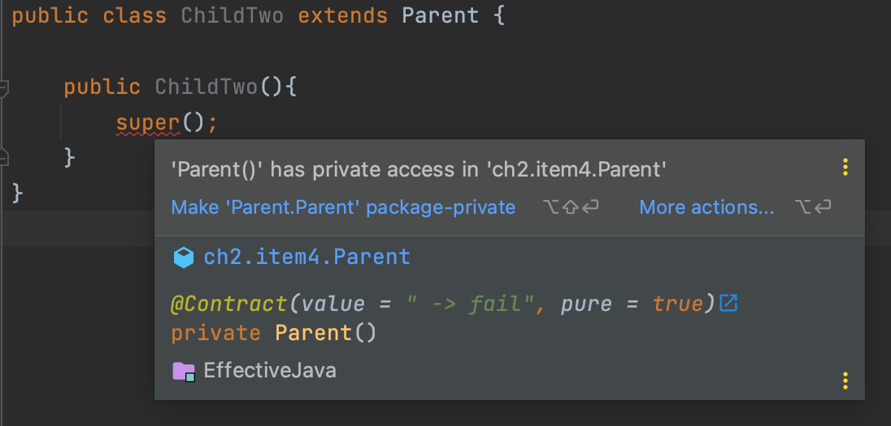

# 아이템 4. 인스턴스화를 막으려거든 private 생성자를 사용하라

- **정적 메서드와 정적 필드만 담은 클래스의 대표적인 예**
    - java.lang.Math : 기본 타입 값으로 구성된다.
    - java.util.Arrays : 배열 관련 메서드로 구성된다.
    - java.util.Collections : ‘특정 인터페이스를 구현하는 객체’를 생성해주는 정적 메서드로 구성됨

    <br/>

- **클래스에 private 생성자를 만들어 둘 경우 인스턴스화 방어 가능**
    - 생성자가 없으면 Java 컴파일러가 매개변수가 없는 public 생성자를 만들어 버리기 때문에 private 생성자를 만들어서 인스턴스화를 방어할 수 있다.
    - 정적 멤버만을 담은 유틸리티 클래스와 같이 인스턴스화 되지 않아야하는 클래스에 사용된다.
    - 추상 클래스의 경우에도 상속 받은 하위 클래스로 인스턴스화가 가능하기 때문에 private 생성자가 있어야한다.

        ```java
        public abstract class Parent {
           // 생성자 없을 경우
        }
        
        public class ChildOne extends Parent {
        
            public ChildOne(){
                super();
            }
        
        }
        
        public class ChildTwo extends Parent {
        
            public ChildTwo(){
                super();
            }
        }
        ```

        - 컴파일시 Parant가 인스턴스화 가능함
      
        <br/>

      ```java
        public abstract class Parent {
        
            private Parent(){
                throw new AssertionError();
            }
        }
        ```
       

        ```text
        java: Parent () has private access in ch2.item4. Parent
        ```

        - private 생성자 제공시 인스턴스화하지 못하게 되어 상속이 불가능해진다.